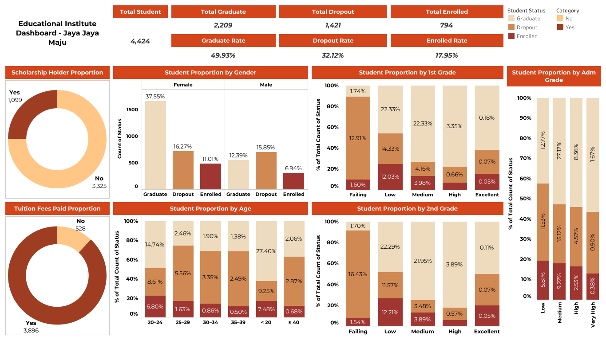

# Institute Students Dropout Problem

## Business Understanding
Jaya Jaya Institut adalah institusi pendidikan tinggi yang berdiri sejak tahun 2000 dan telah melahirkan lulusan‐lulusan berprestasi tinggi. Namun, belakangan ini institusi menghadapi tingkat dropout yang cukup tinggi, mengancam reputasi dan efektivitas program pembelajaran. Mahasiswa yang berhenti di tengah jalan bukan hanya merugikan individu secara finansial dan emosional, tetapi juga berdampak negatif pada citra serta sumber daya institusi (biaya operasional, biaya beasiswa, dan penggunaan fasilitas).

Dengan latar belakang tersebut, Jaya Jaya Institut ingin memahami faktor‐faktor utama yang mendorong mahasiswa untuk berhenti kuliah (dropout). Data historis performa akademik dan demografis telah tersedia dalam bentuk dataset “students performance”. Tugas utama adalah mengolah data ini—dari eksplorasi awal sampai pemodelan prediktif dan visualisasi—agar tim manajemen dan pembimbing akademik dapat:
1. Mendeteksi sedini mungkin mahasiswa yang berisiko tinggi dropout.
2. Memberikan intervensi (bimbingan akademik dan dukungan finansial) secara tepat waktu.
3. Memonitor perkembangan performa mahasiswa melalui dashboard interaktif.

## Business Problem
- **Tingkat dropout yang tinggi** (sekitar 25–30 % dalam data historis) menunjukkan bahwa banyak mahasiswa gagal menyelesaikan studi, padahal banyak yang memiliki potensi dan dukungan awal.
- **Kurangnya sistem peringatan dini** untuk mengidentifikasi mahasiswa yang berisiko sejak semester pertama atau kedua. Selama ini identifikasi bersifat manual dan reaktif (ketika mahasiswa sudah jauh tertinggal).
- **Sedikitnya transparansi** dalam memantau performa akademik setiap mahasiswa secara real time—tim pembimbing dan manajemen membutuhkan dashboard visualisasi untuk melihat tren nilai, jumlah mata kuliah disetujui, dan variabel penting lainnya.
- Akibatnya, Jaya Jaya Institut tidak dapat mendeteksi pola‐pola penting (misalnya, lemahnya nilai semester pertama, atau ketidaktepatan pembayaran biaya kuliah) yang pada akhirnya memicu mahasiswa berhenti.

## Project Goals
1. **Memahami Data dan Menyediakan Ringkasan Deskriptif**  
   - Exploratory Data Analysis (EDA) untuk mengetahui distribusi nilai, jumlah mata kuliah terbaik/terlemah, dan demografi dasar (usia, jurusan, metode pendaftaran, dsb.).  
   - Identifikasi missing values dan outlier, serta bagaimana variabel‐variabel tersebut berkorelasi dengan status dropout.

2. **Membangun Model Prediksi Dropout**  
   - Preprocessing data—mapping nilai kategorikal, handling missing, serta feature engineering (misalnya, perhitungan rasio mata kuliah disetujui vs. diambil).  
   - Menggunakan metode resampling (SMOTE/SMOTEENN) untuk menyeimbangkan kelas mahasiswa “Dropout” vs. “Graduate”.  
   - Melatih beberapa algoritma (Logistic Regression, Random Forest, XGBoost), memilih metrik F2‐score untuk memprioritaskan recall (mengurangi False Negative—mahasiswa berisiko tinggi yang tidak terdeteksi).  
   - Melakukan hyperparameter tuning dan validasi silang agar model memiliki generalisasi baik.

3. **Menciptakan Dashboard Interaktif**  
   - Mengembangkan dashboard (menggunakan Streamlit) yang memungkinkan manajemen dan staf akademik:  
     - Melihat ringkasan statistik (jumlah mahasiswa per jurusan, persentase dropout per kategori, dsb.).  
     - Menampilkan grafik tren—boxplot, histogram, pie chart—untuk fitur‐fitur kritis (nilai semester pertama/semester kedua, status beasiswa, dsb.).  
     - Menginput data mahasiswa baru (atau simulasi) dan mendapatkan prediksi risiko dropout secara real time.

4. **Memberi Rekomendasi Bisnis**  
   - Menyusun daftar rekomendasi praktis berbasis hasil analisis dan model prediktif—misalnya, program bimbingan intensif, bantuan finansial, mentoring lintas angkatan, dan early‐warning triggers.  
   - Menyusun action plan berkelanjutan agar institusi dapat memonitor dampak intervensi setiap semester.

## Project Scope
- **Cakupan Data**  
  - Dataset “students’ performance” mencakup informasi demografis (usia, jenis kelamin, jurusan, metode pendaftaran), data akademik semester pertama dan kedua (jumlah mata kuliah diambil, dievaluasi, disetujui, nilai rata-rata), status pembayaran biaya kuliah, beasiswa, dan status akhir (“Dropout”, “Graduate”, atau “Enrolled”).  
  - Hanya mahasiswa dengan status “Dropout” dan “Graduate” yang diambil untuk modeling prediksi.

## Preparation
Sumber data: [Data Students Performance](https://github.com/dicodingacademy/dicoding_dataset/blob/main/students_performance/data.csv)<br>
Setup environment:
1. Clone Repository
```bash
git clone https://github.com/hildanida/Institute-Problem-Student-Dropout.git
```
2. Creat Virtual Environment
```bash
# Windows
python -m venv env
env\Scripts\activate

# Mac/Linux
python3 -m venv env
source env/bin/activate
```
3. Install Library
```bash
pip install -r requirements.txt
```
4. Library Used
```bash
# Untuk analisis data
import pandas as pd
import numpy as np

# Untuk visualisasi
import matplotlib.pyplot as plt
import seaborn as sns
import plotly.express as px

# Untuk dashboard interaktif
import streamlit as st
```

## Machine Learning System
Untuk membantu Jaya Jaya Institut memprediksi risiko mahasiswa yang akan dropout secara lebih dini, telah dibangun sebuah sistem prediksi berbasis web menggunakan Streamlit. Berikut langkahnya untuk menjalankan aplikasi ini secara lokal:
```bash
streamlit run deployment-machine-learning.py
```
Streamlit juga bisa dapat diakses melalui Streamlit Cloud melalui tautan [ini](https://institute-problem-student-dropout.streamlit.app/)

## Business Dashboard

Dashboard ini [Students Performance Dashboard](https://public.tableau.com/views/StudentDropoutandGraduateAnalysis/Dashboard?:language=en-US&:sid=&:redirect=auth&:display_count=n&:origin=viz_share_link) memberikan gambaran menyeluruh mengenai kondisi akademik dan non-akademik mahasiswa, dengan fokus pada status dropout, kelulusan, dan masih terdaftar (enrolled). Dari total 4.424 mahasiswa, sekitar 32% mengalami dropout—angka yang cukup tinggi. Visualisasi memperlihatkan bahwa dropout lebih banyak terjadi pada mahasiswa laki-laki, usia <25 tahun, serta mereka yang memiliki nilai rendah pada semester pertama dan kedua. Mahasiswa yang belum melunasi biaya kuliah juga cenderung lebih rentan dropout, sementara penerima beasiswa menunjukkan kecenderungan lebih stabil dalam menyelesaikan studi. Selain itu, nilai awal masuk (admission grade) dan jurusan tertentu juga tampak memiliki korelasi terhadap keberlanjutan studi. Secara keseluruhan, dashboard ini menjadi alat penting untuk mendeteksi kelompok mahasiswa berisiko tinggi dan menjadi dasar bagi institusi dalam mengambil kebijakan strategis seperti pemberian bantuan finansial, pendampingan akademik, dan program bimbingan mahasiswa baru.

## Conclusion
1. **Angka Dropout Tinggi**  
   - Sekitar 30 % mahasiswa berhenti, sementara 49 % lulus—menunjukkan kebutuhan intervensi untuk menekan angka drop out.

2. **Fokus di Semester Dua**  
   - Jumlah mata kuliah disetujui dan diambil pada semester kedua adalah prediktor utama risiko putus kuliah.

3. **Performa Semester Pertama**  
   - Nilai dan banyak mata kuliah tanpa evaluasi di semester pertama juga memengaruhi kemungkinan drop out.

4. **Pembayaran dan Beasiswa**  
   - Mahasiswa yang tepat waktu membayar kuliah atau mendapatkan beasiswa cenderung memiliki risiko drop out lebih rendah.

5. **Pengaruh Jurusan dan Jalur Masuk**  
   - Beberapa jurusan (misalnya Informatics Eng, Basic Education) dan jalur pendaftaran tertentu menunjukkan pola risiko berbeda.

6. **Usia Mendaftar**  
   - Mahasiswa lebih muda memiliki risiko drop out lebih tinggi dibanding yang lebih tua.

7. **Rekomendasi Implementasi**  
    - Berikan dukungan ekstra di semester kedua (tutor, workshop), perhatian khusus pada mahasiswa muda, dan pastikan pembayaran kuliah lancar.

Secara keseluruhan, hasil analisis dan pemodelan memberikan gambaran komprehensif tentang faktor‐faktor risiko drop out serta dasar rekomendasi untuk menurunkan angka drop out di kampus.
  
## Recommendation
1. **Early Warning & Monitoring**  
   - Pasang dashboard terintegrasi untuk memantau nilai dan jumlah mata kuliah yang disetujui setiap semester.  
   - Kirim notifikasi otomatis ke dosen wali atau penasihat akademik jika indikator awal (nilai rendah atau sedikit mata kuliah disetujui) terdeteksi; tindak lanjuti dengan bimbingan intensif dalam 1–2 minggu.

2. **Bimbingan Akademik & Pendampingan**  
   - Sediakan workshop/remidi dan kelompok belajar bagi mahasiswa dengan nilai semester pertama rendah atau sedikit mata kuliah disetujui.  
   - Pastikan setiap mahasiswa berisiko tinggi (misal nilai semester kedua di bawah rata‐rata) mendapat pertemuan rutin dengan tutor atau mentor setiap bulan.

3. **Dukungan Keuangan & Beasiswa**  
   - Terapkan paket bantuan biaya (bridge financing) bagi mahasiswa yang menunggak pembayaran, dengan proses pengajuan yang cepat.  
   - Berikan beasiswa mikro untuk mahasiswa berprestasi akademik semester awal yang belum memiliki beasiswa.

4. **Program Mentoring & Konseling**  
   - Pasangkan mahasiswa baru (terutama usia < 25 tahun) dengan peer mentor atau alumni yang berpengalaman di jurusan serupa.  
   - Perkuat layanan konseling psikologis dan financial counseling—pastikan mudah diakses (online booking) dan informasikan secara rutin.

5. **Evaluasi & Refinement Berkelanjutan**  
   - Lakukan monitoring bulanan terhadap tren performa (nilai, jumlah mata kuliah disetujui, status pembayaran).  
   - Tinjau hasil model prediksi setiap akhir semester untuk menyesuaikan intervensi, dan kumpulkan umpan balik mahasiswa untuk terus memoles program.

Dengan menerapkan poin‐poin di atas secara konsisten, institusi dapat menekan angka dropout lebih awal dan meningkatkan retensi mahasiswa.
